### 项目介绍
个人学习项目 基于[网易云开放API](https://autumnfish.cn/)
开发的微信小程序

### 项目功能
目前有登录 每日推荐 推荐歌单 获取排行榜 音乐播放 歌词滚动 高亮当前歌词 切换上/下一首歌曲 观看视频 歌曲搜索 历史搜索 等功能

### 项目安装
* git 克隆到本地
* 微信开发者工具点击详情 本地设置 
* 勾选将JS编译成ES5 使用npm 模快 不校验合法域名、web-view...
* npm i 
* 编译前点击工具栏 构建npm 
* 安装[网易云开放API](https://neteasecloudmusicapi.vercel.app/#/?id=%e5%ae%89%e8%a3%85)
* 运行后台项目
* 最后点击编译

### 项目截图预览

#### 主页
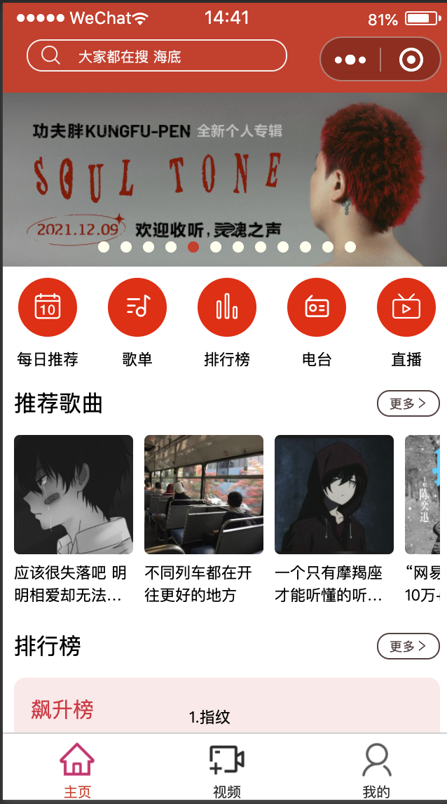
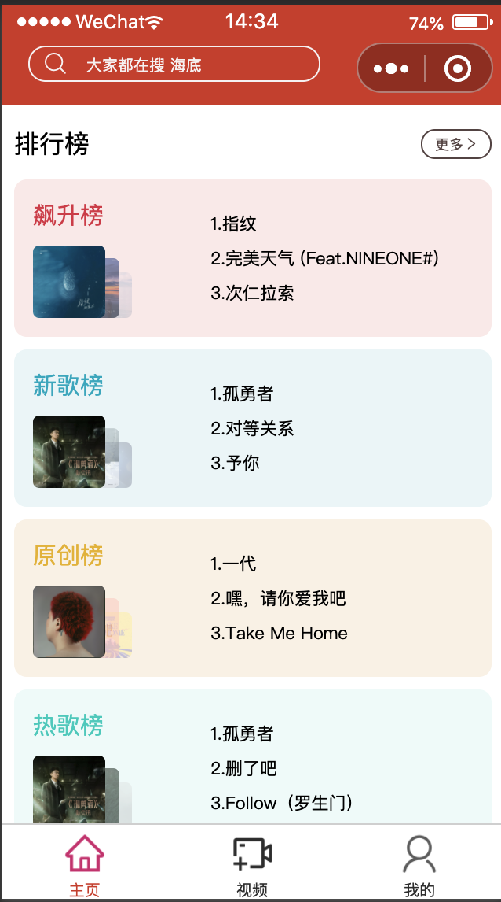

#### 个人中心页面
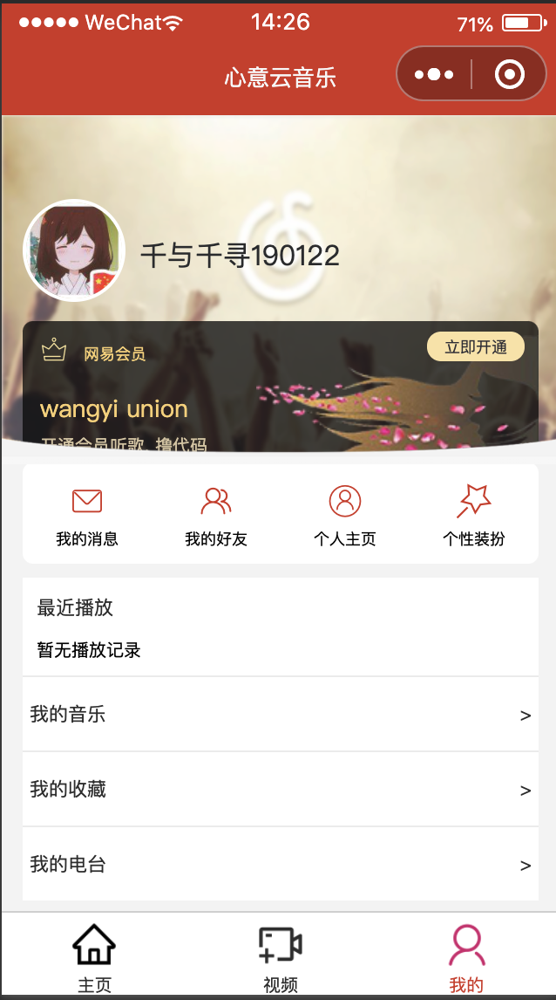

#### 登录页面
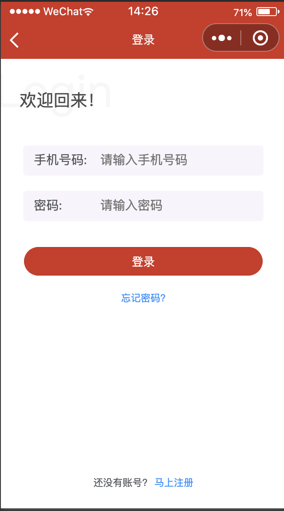

#### 每日推荐
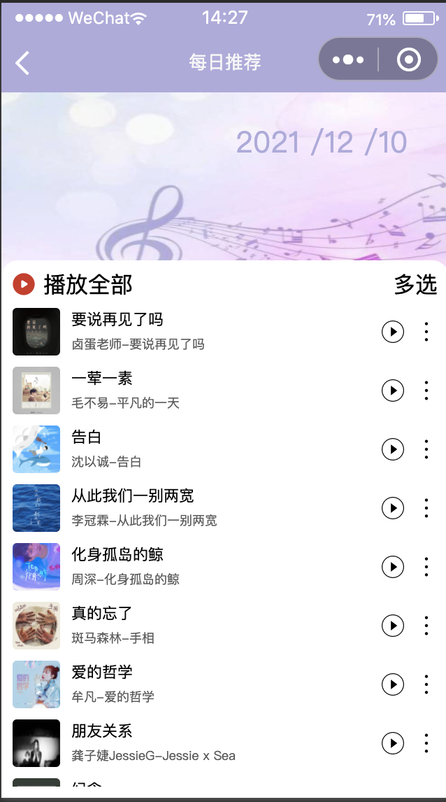

#### 推荐歌曲
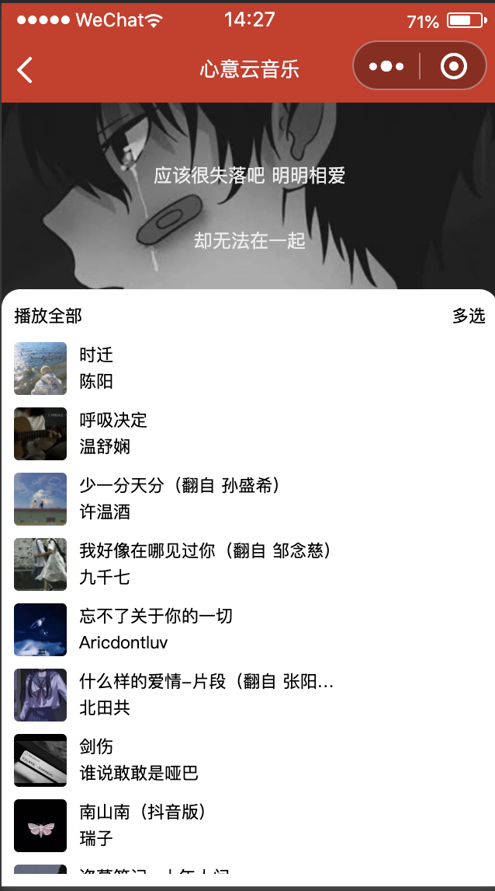

#### 视频页面

#### 搜索页面
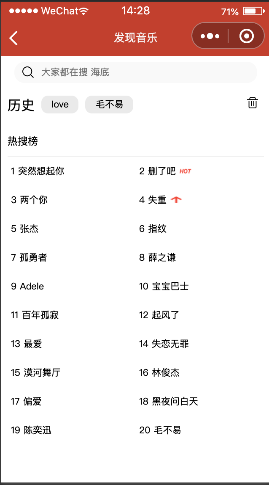
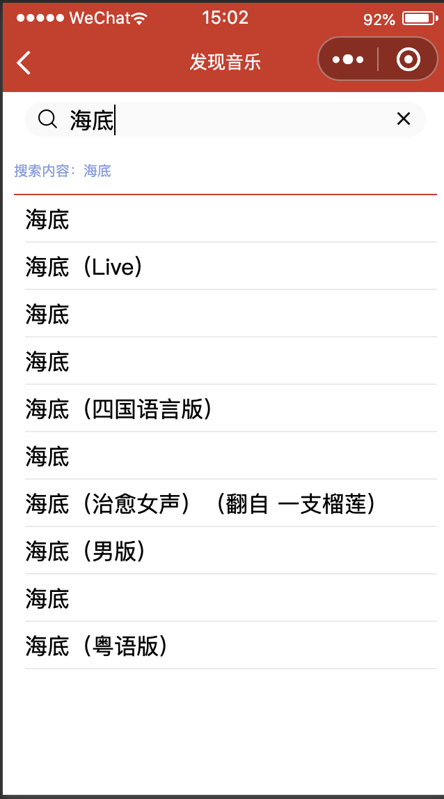
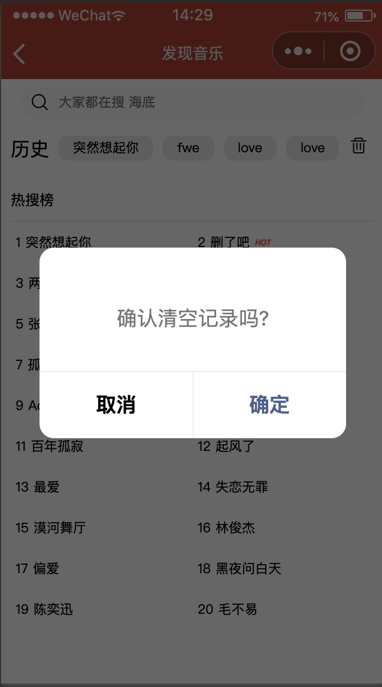

#### 播放页面
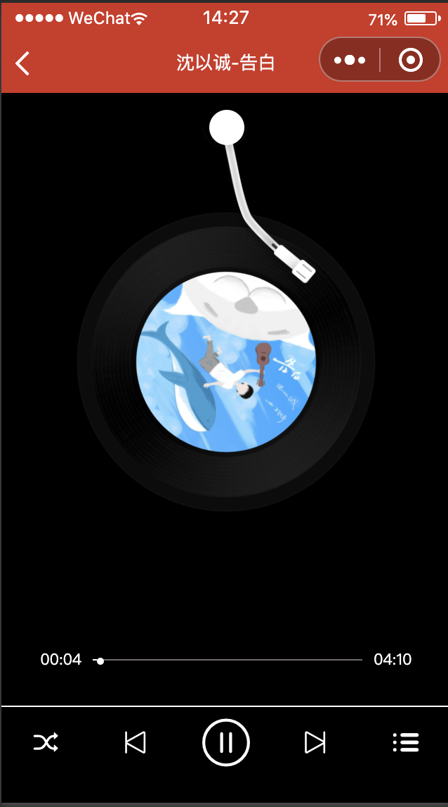
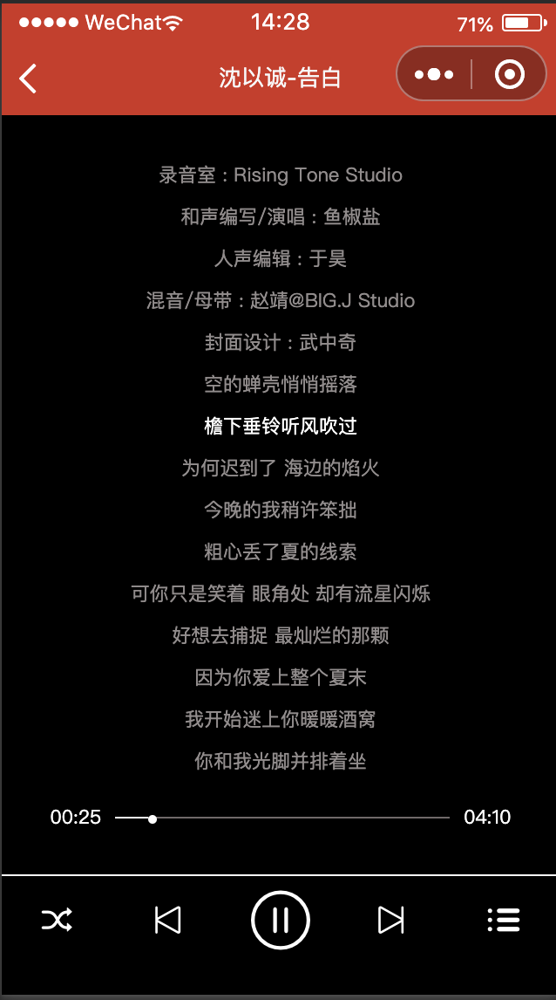

### 视频预览
[预览链接](https://cxyxiaoyuyu.github.io/miniprogram-music/index.html)
